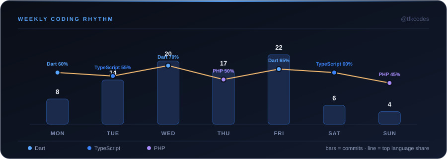

  

  
  
  

  
  
  
  

 

  
  
  

 

### 🧭&nbsp; About

Product Engineer passionate about building scalable, performant, user-centric software — turning ideas into shipped products and automating real business workflows. Comfortable end-to-end: from architecture and backend systems to the interfaces people actually use.

 

### 🛠️&nbsp; Tech Stack

   
  

 

### 📊&nbsp; GitHub Overview

  
  

  

 

### 🚀&nbsp; Featured Projects

<table width="100%">
<tr>
<td width="50%" valign="top">
<h4>🏦 PM Finance</h4>
FinTech platform for lending & financial management.  
   
<a href="https://github.com/tfkcodes/pm-finance">View Repository →</a>
</td>
<td width="50%" valign="top">
<h4>🔐 Authix</h4>
Secure authentication & user management system.  
   
<a href="https://github.com/tfkcodes/authix">View Repository →</a>
</td>
</tr>
<tr>
<td width="50%" valign="top">
<h4>🌱 Beno Group</h4>
AgriTech platform connecting farmers, investors & markets.  
   
<a href="https://github.com/tfkcodes/beno-group">View Repository →</a>
</td>
<td width="50%" valign="top">
<h4>⚡ Create Flutter CLI</h4>
CLI tool to speed up Flutter project development.  
  
<a href="https://github.com/tfkcodes/create-flutter-cli">View Repository →</a>
</td>
</tr>
</table>

<a href="https://github.com/tfkcodes?tab=repositories">Explore more repositories →</a>

 

### 📈&nbsp; Contribution Activity

  

 

### 🕒&nbsp; Weekly Coding Rhythm

  

 

  <i>"Building with <b>passion</b>, shipping with <b>purpose</b>."</i>

  Open to collaboration on impactful ideas — <a href="mailto:hello@tfkcodes.dev">let's talk</a>.

