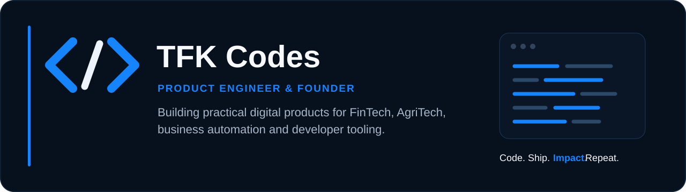

  

  
  
  

## About

I’m **Luciano Jackson — TFK Codes**, a product engineer and founder based in Tanzania. I design and build scalable, user-centred software across **FinTech, AgriTech, business automation and developer tools**.

  
  
  

## Engineering stack

  

## GitHub overview

  

  

  

## Selected repositories

  

  

  

  

## Contribution activity

  

---

  Building with <strong>purpose</strong>, shipping products that create measurable impact.

